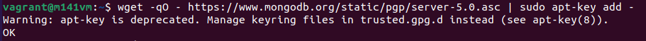

# MongoDB
## Rechere Auftrag  
Vorteile:  
* Leicht skalierbar  
* Gut für grosse Datenbanken  
* Keine fixe Struktur  

Nachteile:  
* Es wird mehr Speicher benötigt  

Anwendungsfälle:  
* Unstrukturierte Daten  
* Big Data  

Marken welche NoSQL verwenden:  
* Ebay  
* Google  

Hersteller und Lizenzen von MongoDB  
* Firma MongoDB  
* Open Source  

## Namensunterschiede   
Zwischen RDBMS und NoSQL gibt es verschiedene Unterschiede in der Bennenung.  
So wird z. B. die Spalte als Feld bezeichnet.  

Realtional DBMS | NoSQL
-------- | --------
Database | Database
Table | Collection
Tuple/Row | Document
column | Field
Table Join | Embedded Documents
Primary Key | Primary Key (Default key _id provided by MongoDB itself)

Bei MongoDB wird BJSON verwendet, da es performanter ist (BJSON = binary JSON).   

## Voraussetzungen für die Installation (VM)
Quelllen  
* Der Key wird von `https://www.mongodb.org/static/pgp/server-5.0.asc` installiert  
* Das Repository kommt vin `https://repo.mongodb.org/apt/ubuntu focal/mongodb-org/5.0 multiverse`  

Version von MongoDB  
* Aktuell ist die Version 5.0.7 von MongoDB installiert (Shell `mongod --version`).  

Die Abhängigkeiten wurden in der folgenden Version installiert:   
* mongodb-org-shell (5.0.7)  
* mongodb-database-tools (100.5.2)  
* mongodb-org-mongos (5.0.7)  
* mongodb-org-database-tools-extra (5.0.7)  
* mongodb-org-database (5.0.7)  
* mongodb-org-tools (5.0.7)  
* mongodb-org (5.0.7)  
* Processing triggers for man-db (2.9.4-2)  

## Installation und Test
Für die Installation muss zu erst der Key installiert werden.
Dies kann mit folgendem Befehl gemacht werden:  
```shell
wget -qO - https://www.mongodb.org/static/pgp/server-5.0.asc | sudo apt-key add -
```


Da es keinen Fehler gab, bin ich zum nächsten Schritt gegangen.  
Dabei habe ich die MongoDB Quelle hinzugefügt: 
```shell
echo "deb [ arch=amd64,arm64 ] https://repo.mongodb.org/apt/ubuntu focal/mongodb-org/5.0 multiverse" | sudo tee /etc/apt/sources.list.d/mongodb-org-5.0.list
```


Dann habe ich die Paketlisten neu eingelesen und aktualisiert:
```shell
sudo apt update
```


So kann man jetzt im letzten Schritt MongoDB installieren:  
```shell
sudo apt-get install -y mongodb-org
```


Nach der Installtion kann man überprüfen ob, MongoDB läuft:  
```shell
sudo systemctl start mongod

sudo systemctl status mongod
```


Damit der MongoDb Dienst auch nach dem Neustarten automatisch gestartet wird, muss dieser Befehl ausgeführt werden:  
```shell
sudo systemctl enable mongod
```


## Verwendung MongoDB
Um MongoDB zu nutzen, muss im Terminal `mongo` oder `mongosh` eingegeben werden.  
Im Browser kann mittels `localhost:27017` eine HTTP Verbindung aufgebaut werden.  
