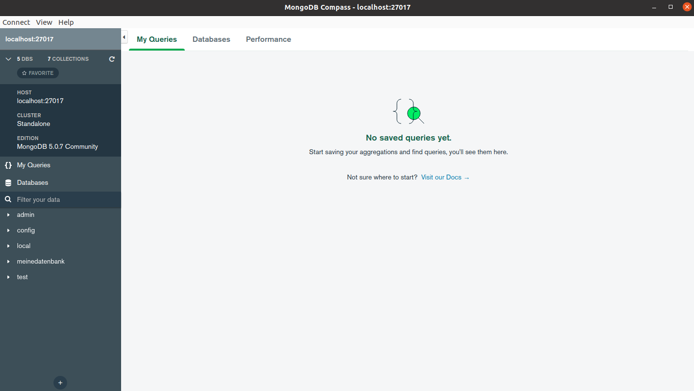

# MongoDB Basics 
## Datenbank erstellen und benutzen
Mit diesem Befehl wird eine Datenbank erstellt und ausgewählt.  
Falls sie bereits erstellt wurde, wird sie nur ausgewählt.  
```
use DATENBANK
```

## Welches ist die aktuell Ausgewählte Datenbank?
Mit diesem Befehl wird augelistet, welche Datenbank aktuell ausgewählt ist:  
```
db
```

## Datenbanken auflisten
Um alle Datenbanken aufzulisten, wird dieser Befehl verwendet:  
*Leere DB werden nicht aufgelistet*  
```
show dbs
```

## Collection erstellen
Collection -> Das selbe wie eine Tabelle in MySQL.  

Hier ein simples Beispiel (In der Klammer ist der Namer der Collection):
```
db.createCollection("Testcollection")
```

Hier ein Beispiel mit einem Datensatz:  
```
db.Testcollection.insert({ Name: "Honey", Alter: 25, Autos: [ "Audi R8" ] })
```

## Collections auflisten
Mit diesem Befehl können Collections aufgelistet werden:  
```
show collections
```

## Collection löschen
Collections könenn ganz einfach so gelöscht werden:  
```
db.Testcollection.drop()
```

## Dokumente aus einer Collection finden / suchen
Dokumente -> Datensatz in MySQL  

Mit `find` kann nach einem bestimmten Dokument gesucht werden:  
```
db.Testcollection.find( { Name: "Honey", Alter: 25 } )
```

Wenn alle Dokumente aufgelistet werden möchten, kann dieser Befehl verwendet werden:  
```
db.Testcollection.find( {} )
```

## Dokumente in eine Collection einfügen
Falls die Collections noch nicht erstellt wurde, wird automatisch eine neue erstellt.  

Hier wird ein Dokument erstellt:  
```
db.Testcollection.insert({ Name: "Honey", Alter: 25, Autos: [ "Audi R8" ] })
```

## Dokumente auf einer Collection löschen
Mit diesem Befehl können Dokumente gelöscht werden:  
```
db.Testcollection.remove ( { Alter: 25 } )

db.Testcollection.remove ( { Alter: 28 , Name : "Honey"}, 1 )
```
*Nach der geschweiften Klammer und dem Komma, kann der `justOne` Parameter gesetzt werden. Falls dieser aktiviert wird, wird nur der erste EIntrag gelöscht*

# Client GUI Programm
Ich habe als GUI für MongoDB den "MongoDB Compass" verwendet. 


Nach der Installtion, konnte ich mich mit der Datenbank verbinden.  
Die Dokumente wurden aufgelistet und ich konnte nach Werten suchen.  

