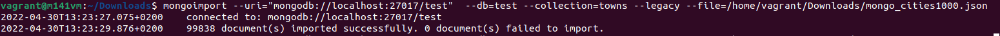
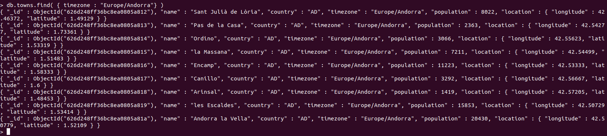
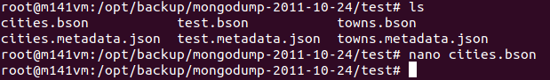
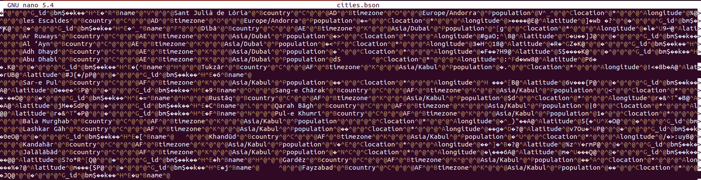
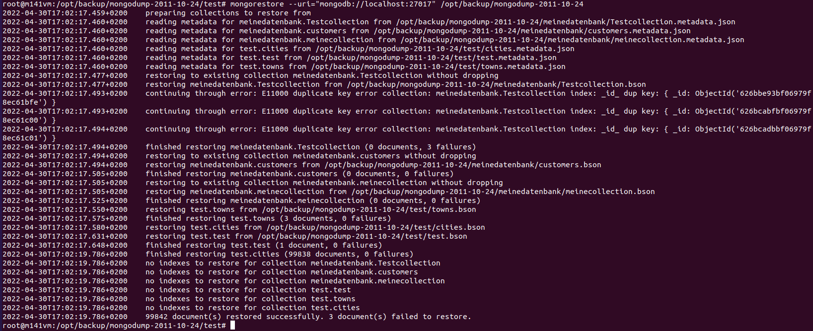

# Aufträge zu Import/Export/Backup/Restore und Queries
### 1. Auftrag : Import  
```bash
mongoimport --uri="mongodb://localhost:27017/test"  --db=test --collection=towns --legacy --file=/home/vagrant/Downloads/mongo_cities1000.json
```
Ausgabe:  
  

### 2. Auftrag : Queries  
Listen Sie alle Städte aus der Timezone "Europa" (alle Zeitzonen von Europa) auf.  
```javascript
db.towns.find( { timezone : "Europe/Andorra"} )
```
Ausgabe:  
  

### 3. Query Ausführen  
Führen Sie die folgende Query auf Ihrer Datenbank aus:  
```javascript
db.cities.aggregate([
    {
    $match: {
        'timezone': {
        $eq: 'Europe/London'
        }
    }
    },
    {
    $group: {
        _id: 'averagePopulation',
        avgPop: {
        $avg: '$population'
        }
    }
    }
])
```
Was macht die Query?
*aggregate* -> Holt sich die Datem auf der DB, damit diese zum Verarbeiten und Anzeigen weiterverwedent werden können.   
*match* -> Überprüft, ob `timezone` mit `Europe/London` übereinstimmt (Filter).  
*group* -> Gruppiert die Dokumente, so das sie nur einzel angezeigt werden.  
*_id* -> Als ID wird hier nur ein Text ausgegeben, keine Variable.  
*avgPop* -> Ist nur der Name, welcher Ausgegeben wird. `$avg` errechnet den Durchschitt von `$population`.  

### 4. Query Ausführen  
Führen Sie die folgende Query auf Ihrer Datenbank aus:
```javascript
db.cities.aggregate([
    {
    $match: {
        'timezone': {
        $eq: 'Europe/London'
        }
    }
    },
    {
    $sort: {
        population: -1
    }
    },
    {
    $project: {
        _id: 0,
        name: 1,
        population: 1
    }
    }
])
```
Was macht die Query?  
*match* -> Überprüft, ob `timezone` mit `Europe/London` übereinstimmt (Filter).  
*sort* -> Sortiert die Dokumente (1 -> Aufsteigend, -1 -> Absteigend).  
*$project* -> Damit kann bestimmt werden, welche Felder (Spalten) angezeigt werden sollen (0 -> ausgeblendet, 1 -> eingeblendet). `_id` ist automatisch aktiviert.

### 5. Auftrag : Backup und Restore einrichten und durchführen
Führen Sie von Hand (oder über Bash-Script) ein Backup und ein Restore für Ihre Testdatenbank durch

#### Export
Export der Datenbank ins binäre Daten:  
```bash
mongodump --host=localhost --port=27017  --out=/opt/backup/mongodump-2011-10-24
```
*oder mittels --archive=pfad*

Nach dem Export sehen die Daten so aus:  
  

So sehen dann die binären Daten aus:  
  

#### Import
Import der Dateien:  
```bash
mongorestore --uri="mongodb://user@mongodb1.example.net:27017/?authSource=admin" /opt/backup/mongodump-2011-10-24
```
*oder mittels --archive=pfad*

Ausgabe:  
  