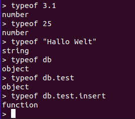

# Javascript in MongoDB
Durch die MongoDB Shell kann man in MongoDB Javascript verwenden.  
So hat man die Möglichkeit Javascript Befehle auszuführen.  

## typeof
Da in Javascript der Typ einer Variablen nicht ausdrücklich deklariert wird kann mit diesem Operator festgestellt werden was für ein Datentyp automatisch ausgewählt wurde.  

Beispiel in MongoDB:  
  
*Mögliche Ausgaben sind: Undefined, Null, Boolean, String, Symbol, Number und Object.*  

