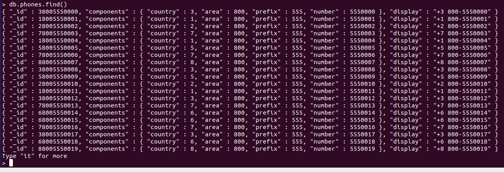
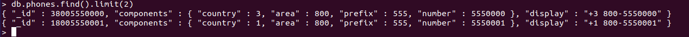
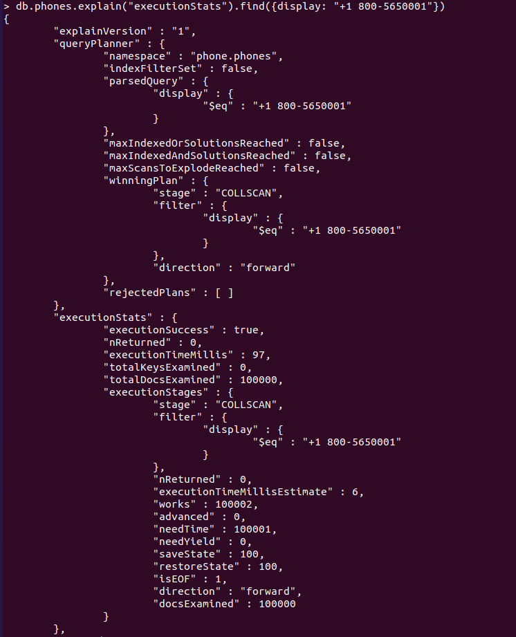
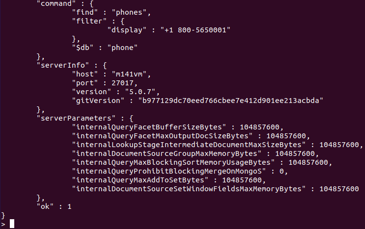

# Übung: Indexierung und Performance  
## Vorbereitung  
Zum beginn des Projektes habe ich das Skript hier ins MongoDB ausgeführt.
```sql
    populatePhones = function(area, start, stop) {
      for(var i = start; i < stop; i++) {
        var country = 1 + ((Math.random() * 8) << 0);
        var num = (country * 1e10) + (area * 1e7) + i;
        var fullNumber = "+" + country + " " + area + "-" + i;
        db.phones.insert({
          _id: num,
          components: {
            country: country,
            area: area,
            prefix: (i * 1e-4) << 0,
            number: i
          },
          display: fullNumber
        });
        print("Inserted number " + fullNumber);
      }
      print("Done!");
    }
```

## Daten generieren  
Dann kann man mit dem Aufruf der Funktion neue Daten generieren. Die Funktion generiert mögliche Telefonnummern in einem Wertebreich mit der Ländervorwahl. Im ersten Feld wird die "Area" bzw. Lädervorwahl definiert, diese wird dann standartmässig in alle erzeugten Daten hinterlegt. Von der zweiten Zahl, bis zur dritten werden dann einzelne Dokumente (Datensätze) erstellt.
```sql
populatePhones(800, 5550000, 5650000) 
```

Das sieht dann folgendermassen aus:  
  

Oder so zum kontrollieren:  
```sql
db.phones.find().limit(2)
```
  

## Indexes auslesen  
Dieser Befehl listet alle Indexes von der aktuellen Collection aus:  
```sql
db.getCollectionNames().forEach(function(collection) {
     print("Indexes for the " + collection + " collection:");
     printjson(db[collection].getIndexes());
});
```
*db.getCollectionNames() -> Gibt ein Array mit allen Collections der DB aus.*

## Testen (normal)  
Um die Performace ohne Indexierung zu testen, kann dieser Befehl verwendet werden:  
```sql
db.phones.explain("executionStats").find({display: "+1 800-5650001"})
``` 
*`executionTimeMillis` -> Ausführungszeit (Milliseconds)*  
*`totalDocsExamind` -> Anzahl durchsuchten Dokumente*  
*`stage` -> Typ des Scans*  
  
Das sah bei mir so aus:  
  
  

Das sind die Resultate von dem Scann:  

**executionTimeMillis:** 97  
**totalDocsExamind:** 100000  
**stage:** COLLSCAN  -> (Collection Scann)  

## Index erfassen  
Mit diesem Befehl erstellt man einen Index:  
```sql
db.phones.createIndex(
  { display : 1 },
  { unique : true, dropDups : true } // soll unique sein, also droppen wir Duplikate
)
```

## Testen (Mit Indexes)  
Das sind die Resultate von dem zweiten Scann mit Indexing:  

**executionTimeMillis:** 3  
**totalDocsExamind:** 0  
**stage:** FETCH  -> (Abrufen von Dokumenten)  