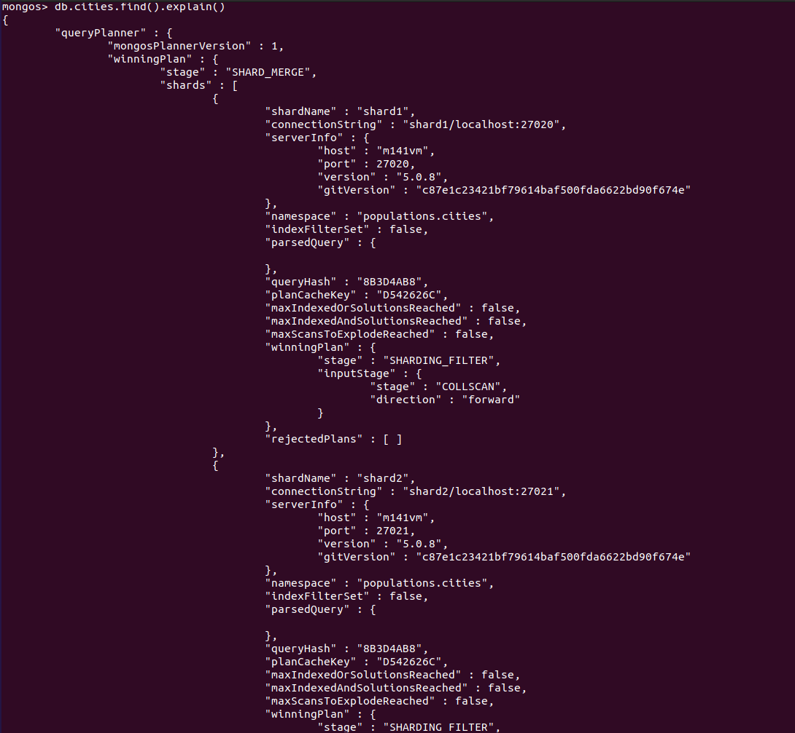

# Sharding und Replication
**Sharding:** Ein grosses System wird in mehrere kleinere Systeme aufgeteilt. Die Systeme teilen sich die Aufgaben, damit jede einzelne Node ihre eigenen Aufgaben ausführt. Herausforderung: Implementierung dieser "Sharding-Methoden".  

**Replication:** Die gesamte Arbeitslast wird auf die Nodes "gleich" verteilt. So kann sich der Primäre Node für die Write Anfragen kümmern und die Sekundäre Nodes um die Read Anfragen. Herausforderung: Die Anfragen müssen clever zu verteilen.  

Sharding und Replication können auch zusammen verwendet werden.  
## Skalierung

Vertikale Skalierung
* System Upgraden (bsp. CPU RAM)

Horizontale Skalierung
* Mehr Nodes / Geräte

  

## Horizontale Skalierung
Zielsetzung:
1. Die Last wird auf mehrere Systeme verteilt. So das jede eizelne Node sich auf eine eigene Aufgabe spezialisiert (Ausfallsicherheit wird nicht berücksichtigt).  
2. Alle Nodes erfüllen die gleiche Aufgabe. Erhöht die Performance und die Ausfallsicherheit (Problem mit CAP -> geht auf die Kosten der Konsistenz).  

# Übung zu Sharding und Replication  
## Replication
### Auftrag 1: Vorbereitung  
Im ersten Schritt müssen 3 Ordner erstellt werden:  
```sql
mkdir ./mongo1 ./mongo2 ./mongo3
```

Jetzt muss man in der /etc/mongod.conf Datei noch folgenden Befehl einfügen / aktivieren:  
```
replication:
  replSetName: book
```
 

### Auftrag 2: Instanzen starten  
Dann man man für jede Instanz ein Terminal öffnen:  
```
mongod --replSet book --dbpath ./mongo1 --port 27011
```

```
mongod --replSet book --dbpath ./mongo2 --port 27012
```

```
mongod --replSet book --dbpath ./mongo3 --port 27013
```

### Auftrag 3: Starten  
Um eine Intialisierung mit den 3 Instanzen zu erstellen, kann dieser befehl verwendet werden (Die Nr. 1 wird zur Primary Node).  
```
rs.initiate({
    _id: 'book',
    members: [
      {_id: 1, host: 'localhost:27011'},
      {_id: 2, host: 'localhost:27012'},
      {_id: 3, host: 'localhost:27013'}
    ]
})
```

### Auftrag 4: Testen
Zum testen kann dieser Befehl verwendet werden:  
```
rs.status().ok
```
*1 -> Gut, 0 -> Schlecht*

Jetzt muss man sich beim Verbinden mit MongoDB auf den ganzen Cluster verbinden.
```
mongo mongodb://localhost:27011,localhost:27012,localhost:27013/replicaSet=book
```

In der primary Node kann man jetzt ein Test Insert machen.  
Dann sollte man den Eintrag auch in den Secondary Nodes sehen.  
```
db.echo.insert({ say : 'HELLO!' })
```

Bei mir hat es funktioniert, aber ich musste zu erst noch den folgenden Befehl im Termianl eingeben. Sonst gab es einen Fehler.  
```
rs.secondaryOk()
db.echo.find()
```

  
## Sharding  
### Auftrag 1 - Config Server
Zu erst muss wieder ein Ordner erstellt werden und einen Konfigurationsserver definieren:  
```bash
mkdir ./mongoconfig

mongod --configsvr --replSet "config" --dbpath ./mongoconfig --port 27016
```

Jetzt kann man sich auf den Konfigurationsserver verbinden:  
```
mongo localhost:27016
```

Um dann den Cluster zu initialisieren:  
```
rs.initiate()
```
*1 -> Gut, 0 -> Schlecht*  

### Auftrag 2 - Shards einrichten  
Jetzt müssen die Verzeichnisse für die Shards erstellt werden:  
```bash
mkdir ./mongo4 ./mongo5
```

Die Shards können gestartet werden:  
```
mongod --shardsvr --replSet "shard1" --dbpath ./mongo4 --port 27020
```

```
mongod --shardsvr --replSet "shard2" --dbpath ./mongo5 --port 27021
```

### Auftrag 2 - Shards intialisieren  
#### Shard 1
Um den Shard 1 zu intialisieren, muss man sich wieder zu erst verbinden:  
```
mongo localhost:27020
```

Dann kann die intialisieren beginnen:  
```
rs.initiate()
```

#### Shard 2
Um den Shard 2 zu intialisieren, muss man sich zu erst verbinden:  
```
mongo localhost:27021
```

Dann kann die intialisieren beginnen:  
```
rs.initiate()
```

### Auftrag 3 - mongos (der Query Router)  
Jetzt muss der Konfigurationsserver definiert werden:  
```
mongos --configdb config/localhost:27016 --port 27025
```

### Auftrag 4 - Shards hinzufügen  
Auf die Instanz verbinden:  
```
mongo localhost:27025
```

Dann müssen beide Shards hinzugefügt werden:  
```
sh.addShard("shard1/localhost:27020")
sh.addShard("shard2/localhost:27021")
```

Jetzt sollten die Shards augelistet werden:  
```
sh.status()
```

### Auftrag 5 - Sharding einbinden
Sharding wird auf die Datenbank `populations` aktiviert:  
```
sh.enableSharding("populations")
```

Die Collection `cities` wird auf beide Shards verteilt:  
Als Shardkey wird das gehaste Attribut `country` genommen.  
```
sh.shardCollection("populations.cities", { "country": "hashed" })
```

### Auftrag 6: - Daten der DB hinzufügen  
Jetzt können wir neue Datensätze auf die Collection hinzufügen:  
```
use populations

db.cities.insertMany([
  {"name": "Seoul", "country": "South Korea", "continent": "Asia", "population": 25.674 },
  {"name": "Mumbai", "country": "India", "continent": "Asia", "population": 19.980 },
  {"name": "Lagos", "country": "Nigeria", "continent": "Africa", "population": 13.463 },
  {"name": "Beijing", "country": "China", "continent": "Asia", "population": 19.618 },
  {"name": "Shanghai", "country": "China", "continent": "Asia", "population": 25.582 },
  {"name": "Osaka", "country": "Japan", "continent": "Asia", "population": 19.281 },
  {"name": "Cairo", "country": "Egypt", "continent": "Africa", "population": 20.076 },
  {"name": "Tokyo", "country": "Japan", "continent": "Asia", "population": 37.400 },
  {"name": "Karachi", "country": "Pakistan", "continent": "Asia", "population": 15.400 },
  {"name": "Dhaka", "country": "Bangladesh", "continent": "Asia", "population": 19.578 },
  {"name": "Rio de Janeiro", "country": "Brazil", "continent": "South America", "population": 13.293 },
  {"name": "São Paulo", "country": "Brazil", "continent": "South America", "population": 21.650 },
  {"name": "Mexico City", "country": "Mexico", "continent": "North America", "population": 21.581 },
  {"name": "Delhi", "country": "India", "continent": "Asia", "population": 28.514 },
  {"name": "Buenos Aires", "country": "Argentina", "continent": "South America", "population": 14.967 },
  {"name": "Kolkata", "country": "India", "continent": "Asia", "population": 14.681 },
  {"name": "New York", "country": "United States", "continent": "North America", "population": 18.819 },
  {"name": "Manila", "country": "Philippines", "continent": "Asia", "population": 13.482 },
  {"name": "Chongqing", "country": "China", "continent": "Asia", "population": 14.838 },
  {"name": "Istanbul", "country": "Turkey", "continent": "Europe", "population": 14.751 }
])
```

#### Auftrag 7 - Kontrolle  
Mit diesem Befehl werden Statistiken zu den Shards angezeigt:  
Man sieht dort welcher Shard wie viel % an Daten darauf verteilt sind und wie gross diese sind.   
```
db.cities.getShardDistribution()
```


### Auftrag 8 - Anwendung  
Jetzt können normale Befehle aufgeührt werden.  
Wenn man einen `find` Befehl noch Beschreibt, dann sieht man zusätzliche inforamtionen zum Befehl (Bsp. die Shards).  
```
db.cities.find().explain()
```

  

## Allgemeine Befehle / Infos
Wenn man einen beliebigen Befehl im Terminal eingibt und es eine Ausgabe mit `ok` = 1 oder 0 gibt, 
dann steht die 1 für das erfolgreiche Ausführung und die 0 für einen Fehler.  

Um sich in MonfoDB im Terminal zu authentifizieren, kann dieser Befehl verwendet werden.  
```
db.auth("benutzer", "passwort")
```

Aus dem Terminal heraus, kann man sich auch direkt mit einem Benutzer verbinden.  
```bash
mongo -u myUserAdmin -p myUserAdmin
```

Auf eine Instanz aus dem Terminal heraus verbinden (Replication)  
```bash
mongo mongodb://localhost:27011
```

Die Konfiguration des Replication, kann mit diesem Befehl angeschaut werden.
```
rs.conf()
```
 

Beim Status werden die einzelnen Nodes mit dem Status aufgelistet (Primär / Sekundär).  
Funktioniert für Replication und Sharding.  
```  
rs.status()
```
   
  

Node / Server hinzufügen und entfernen (in MongoDB):  
```
rs.add("Test")
rs.remove(Test)
```