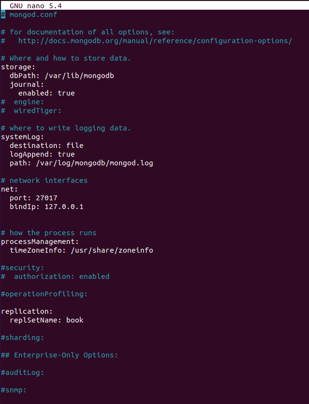
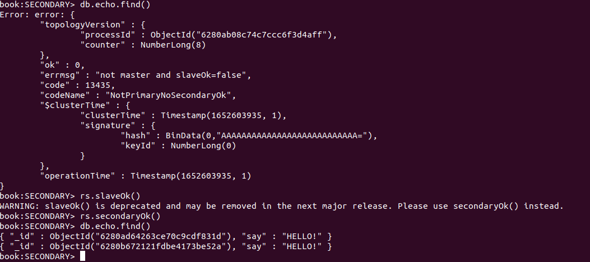
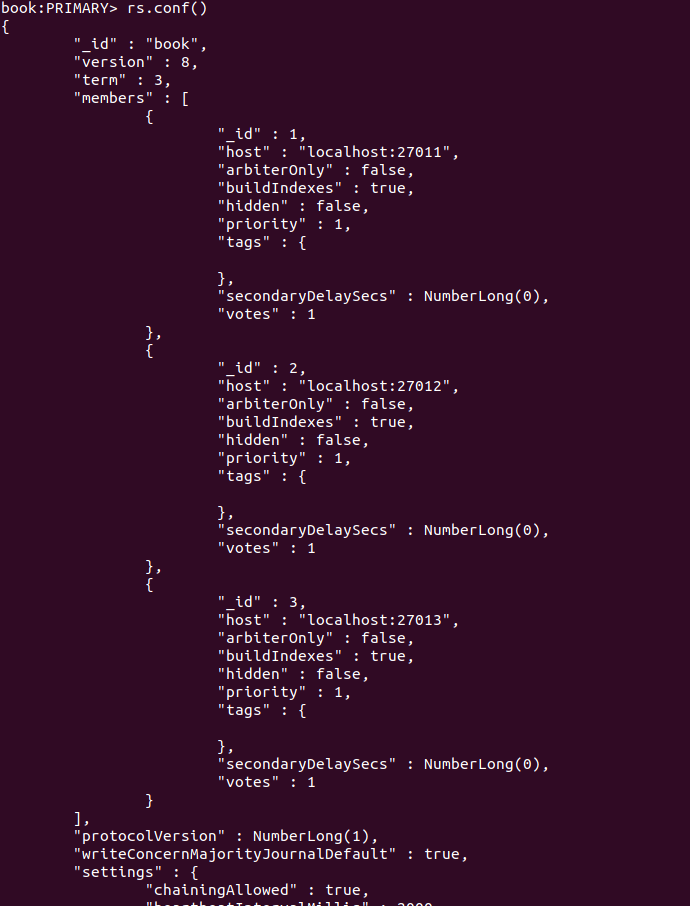
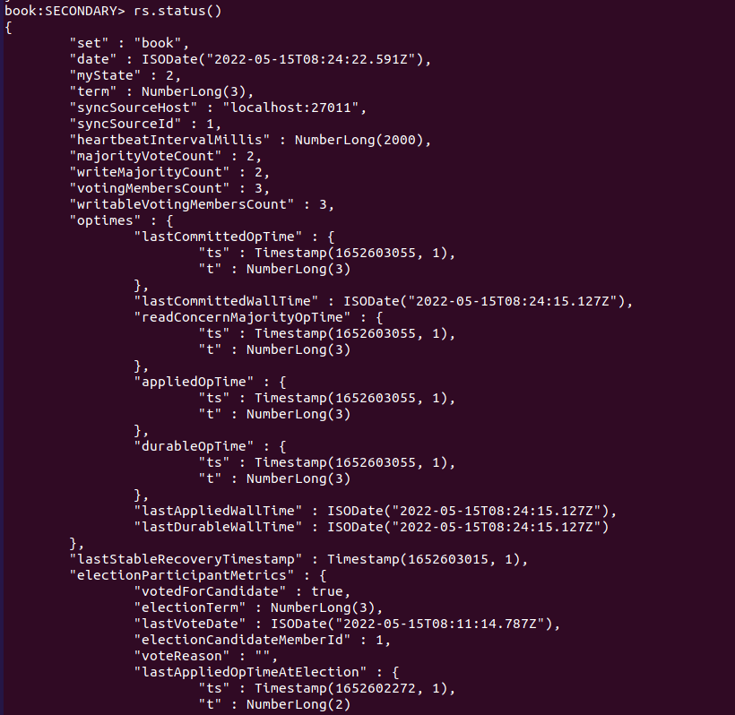
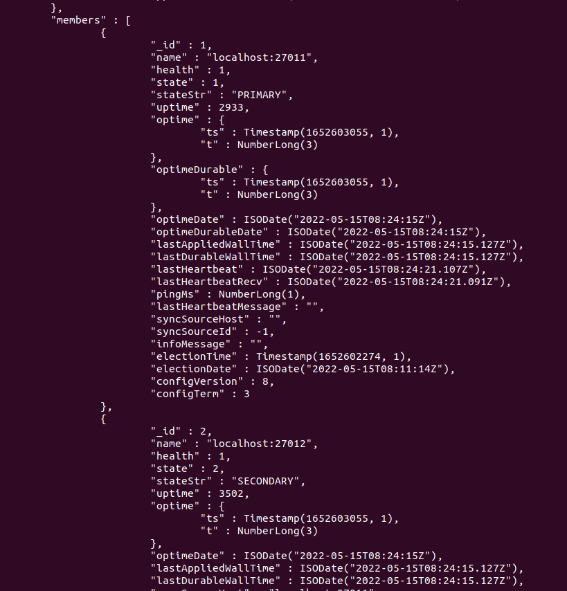

# Sharding und Replication
Sharding : Ein grosses System wird in mehrere kleinere Systeme aufgeteilt. Die Systeme telen sich die Aufgaben, damit jede einzelne Node ihre eigenen Aufgaben ausführt. Herausforderung: Implementierung dieser "Sharding-Methoden".  
Replication : Die gesamte Arbeitslast wird auf die Nodes "gleich" verteilt. So kann sich der Primäre Node für die Write Anfragen kümmern und die Sekundäre Nodes um die Read Anfragen. Herausforderung: Die Anfragen müssen clever zu verteilen.  

Sharding und Replication können auch zusammen verwendet werden.  
## Skalierung

Vertikale Skalierung
* System Upgraden (bsp. CPU RAM)

Horizontale Skalierung
* Mehr Nodes / Geräte

  

## Horizontale Skalierung
Zielsetzung:
1. Die Last wird auf mehrere Systeme verteilt. So das jede eizelne Node sich auf eine eigene Aufgabe spezialisiert (Ausfallsicherheit wird nicht berücksichtigt).  
2. Alle Nodes erfüllen die gleiche Aufgabe. Erhöht die Performance und die Ausfallsicherheit (Problem mit CAP -> geht auf die Kosten der Konsistenz).  

# Übung zu Sharding und Replication  
## Replication
### Auftrag 1 : Vorbereitung  
Im ersten Schritt müssen 3 Ordner erstellt werden:  
```sql
mkdir ./mongo1 ./mongo2 ./mongo3
```

Jetzt muss man in der /etc/mongod.conf Datei noch folgenden Befehl einfügen / aktivieren:  
```
replication:
  replSetName: book
```
 


Dann man man für jede Instanz ein Terminal öffnen:  
```
mongod --replSet book --dbpath ./mongo1 --port 27011
```

```
mongod --replSet book --dbpath ./mongo2 --port 27012
```

```
mongod --replSet book --dbpath ./mongo3 --port 27013
```

Um eine Intialisierung mit den 3 Instanzen zu erstellen, kann dieser befehl verwendet werden (Die Nr. 1 wird zur Primary Node).  
```
rs.initiate({
    _id: 'book',
    members: [
      {_id: 1, host: 'localhost:27011'},
      {_id: 2, host: 'localhost:27012'},
      {_id: 3, host: 'localhost:27013'}
    ]
})
```

### Testen
Zum testen kann dieser Befehl verwendet werden:  
```
rs.status().ok
```
*1 -> Gut, 0 -> Schlecht*

Jetzt muss man sich beim Verbinden mit MongoDB auf den ganzen Cluster verbinden.
```
mongo mongodb://localhost:27011,localhost:27012,localhost:27013/replicaSet=book
```

In der primary Node kann man jetzt ein Test Insert machen.  
Dann sollte man den Eintrag auch in den Secondary Nodes sehen.  
```
db.echo.insert({ say : 'HELLO!' })
```

Bei mir hat es funktioniert, aber ich musste zu erst noch den folgenden Befehl im Termianl eingeben. Sonst gab es einen Fehler.  
```
rs.secondaryOk()
db.echo.find()
```

  
## Allgemeine Befehle
Um sich in MonfoDB im Terminal zu authentifizieren, kann dieser Befehl verwendet werden.  
```
db.auth("benutzer", "passwort")
```

Aus dem Terminal heraus, kann man sich auch direkt mit einem Benutzer verbinden.  
```bash
mongo -u myUserAdmin -p myUserAdmin
```

Auf eine Instanz aus dem Terminal heraus verbinden (Replication)  
```bash
mongo mongodb://localhost:27011
```

Die Konfiguration des Replication, kann mit diesem Befehl angeschaut werden.
```
rs.conf()
```
 

Beim Status werden die einzelnen Nodes mit dem Status aufgelistet (Primär / Sekundär).  
```  
rs.status()
```
   
  

Node / Server hiinzufügen und entfernen (in MongoDB):  
```
rs.add("Test")
rs.remove(Test)
```