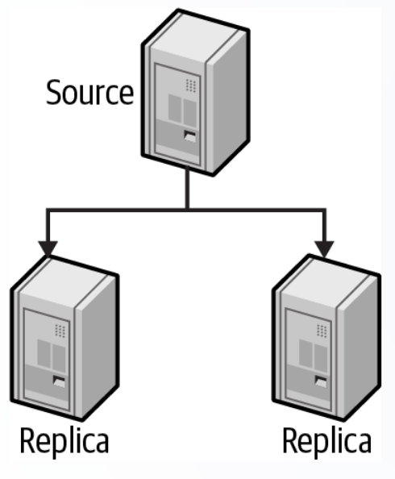
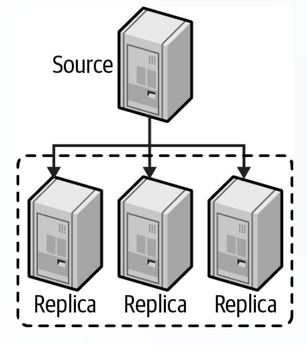
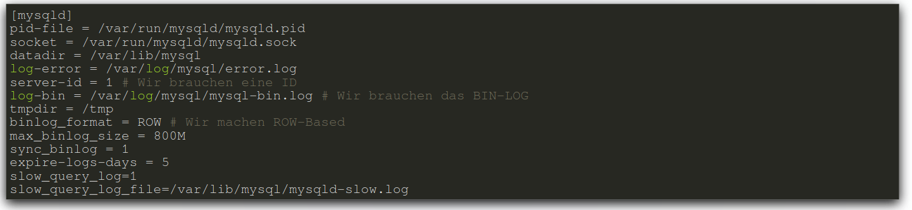
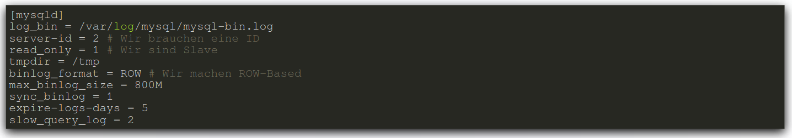

# Replication bei MySQL
## Info - deterministisch vs. nicht deterministisch
`Deterministisch` ist eine Zahl, welche sich nicht verändert.  
So ist dann `nicht deterministisch` eine Zahl die sich verändern kann.  

Beispiel:  
**Nicht deterministische** -> Alter (verändert sich jedes Jahr)  
**Deterministische** -> Geburtstagdatum  

## Replikation Grundsätzlich
Zwischen dem Source Server und den Rplica Nodes werden die Änderungen über Binary Logs (Binäre Log Dateien) übertragen.  

* Statement-based  
    - Alle Befehle werden auf dem Replica wiederholt. Bei grossen `nicht deterministischen` Queries kann es zu unterscheidlichen Datensätzen kommen.   

* Row-based
    - Hier wird übergeben, was geändert wurde. So kann es sein, dass die Binary Log sehr gross werden.  
  
* mixed
    - Hier werden beide Vorteile von oben genommen und verwendet. So wird generell `statement-based` gearbeitet und bei nicht-deterministischen Aufgaben wird `row-based` verwendet.  
  
### Aktiv / Passiv
Bei dem Aktiv / Passiv Beispiel werden Daten auf den Source Server geschrieben. Dazu werden Daten von diesem Server aus gesendet.  
Die Replikationen Nodes können nur für eine Replikation von den Daten gebraucht werden. Die Daten können als Backup verwendet werden.  
  

### Aktiv / Read Pool
Bei dem Aktiv / Lese Pool ist es so, dass die Daten auf den Source Server gespeichert werden und von den Replikations Nodes werden die Daten gelesen.  
Die Daten werden von dem Source Server zu den Replikations Nodes repliziert.  
Dies Erhöht die Performance besonders für die Read Abfragen. Das Schreiben kann natürlich auch positiv beeinflusst werden.   
  

### Wählen des Clusters
* Hohe Lese Lasten (Select Abfragen) -> Replikation mit Read-Pools  
* Hohe Schreib Lasten (Insert / Update / Delete) -> Sharding 

## Konfiguration Replikation
### Master
So könnte das Config File aussehen:  
  
### Slave
So könnte das Config File aussehen:  
  

## Proxies
Hier die Funktionen und Anforderungen an einen Proxy.  

Funktionen:  
* Caching  
* Blocking  
* Monitoring  
* Rate Limiting  

Anforderungen:  
* hochverfügbar
* skalierbar
* leichtgewichtig sein
* automatisiert konfigurierbar sein