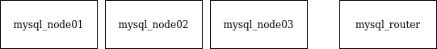
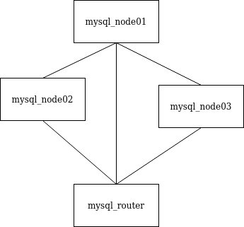
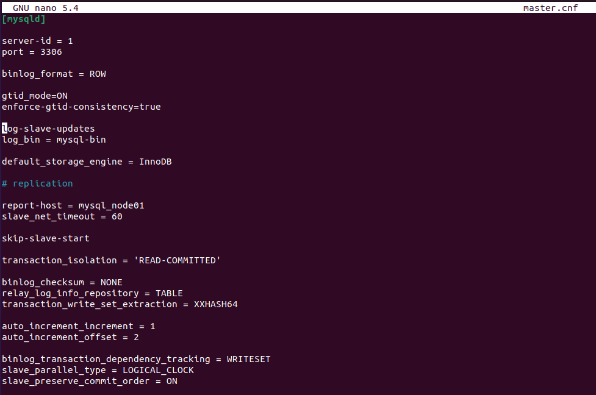
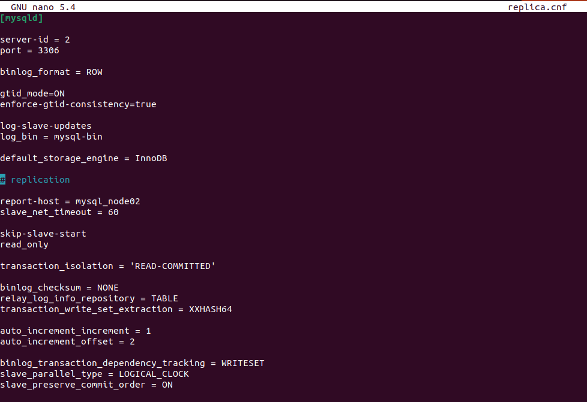
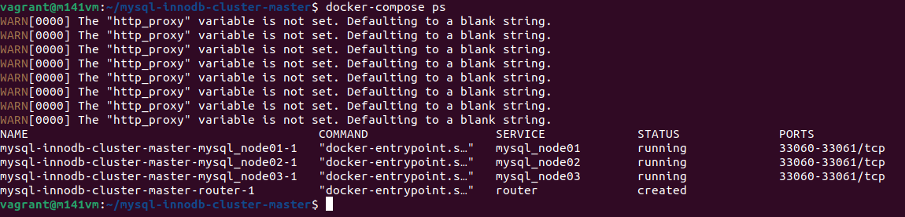
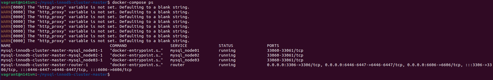
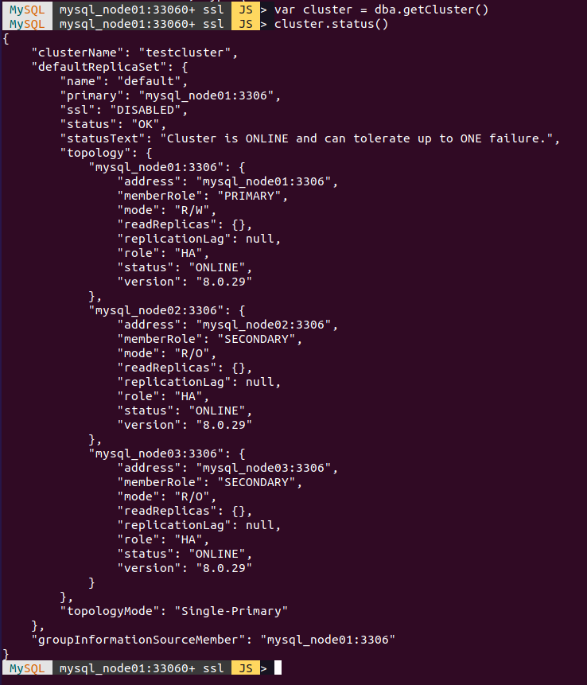

# Replication Übung bei MySQL  
## Aufträge  
Github Repository: [https://github.com/garutilorenzo/mysql-innodb-cluster.git](https://github.com/garutilorenzo/mysql-innodb-cluster.git)  
### Auftrag 1 - Analyse docker-compose.yml  
Welche Services werden aufgebaut? -> Zeichnen Sie ein kleines Netzwerkdiagramm (irgendwie)  
  

Welche Netzwerk werden aufgebaut? -> Erweitern Sie das Diagramm  
  

In der Datei config/master.cnf sehen Sie die Konfiguration für den Master-Node. Dokumentieren!  
  
Die `server-id` ist eine eindutige ID für die Nodes.  
Mit `log-bin` wird das Verzeichnis zur binären Logdatei mitgegeben.  
Mit dem `binlog_format` Befehl kann definiert werden, ob man `Statement-based`, `ROW-Based` oder `mixed` verwenden möchte.  
  
In der Datei config/replica.cns sehen Sie die Konfiguration für den Slave-Node. Dokumentieren!  
  
Mit dem Befehl `read_only` = `1` wird mitgeteilt, das diese Node ein Slave ist.  

### Auftrag 2 - Installation  
Bevor die Installation beginnen kann, muss Mysql gestoppt werden. Sonst gibt es ein Error bei der Erstellung wegen dem Port 3306.  
Dann sieht der Status so aus:  
 

1. Starten der App:  
```
docker-compose up -d
```

2. Auf die Funktionalität überprüfen:  
```
docker-compose ps
```
  

Logs anschauen:  
```
docker-compose logs -f
```

### Auftrag 3 - Kontrolle  
Zur Kontrolle, damit der Cluster funktioniert soll man sich auf dem Master Node anmelden.  
```
docker-compose exec mysql_node01 bash
```

Dann mit dem Root benutzer anmelden
```
mysqlsh --js root@mysql_node01
```

Jetzt kann man den Status des Clusters ausgeben.  
```
mysql-js> var cluster = dba.getCluster()
mysql-js> cluster.status()
```
  

Als Info:  
Der Docker COntainer kann mit diesem Befehl gestoppt werden.  
```
docker-compose down
```