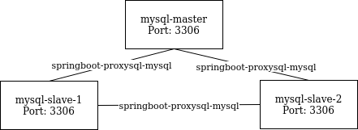
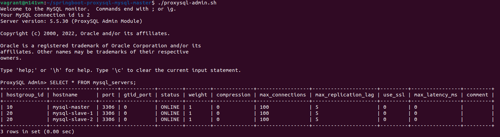

# ProxySQL und Spring Boot
Github Repository: [https://github.com/ivangfr/springboot-proxysql-mysql](https://github.com/ivangfr/springboot-proxysql-mysql)  

## Auftrag 1 - Analyse docker-compose.yml  
1. Welche Services werden aufgebaut? -> Zeichnen Sie ein kleines Netzwerkdiagramm (irgendwie)  
2. Welche Netzwerk werden aufgebaut? -> Erweitern Sie das Diagramm  
Ich habe im gesamten Projekt nach der Datei gesucht. Ich konnte sie jedoch nicht finden. Also habe ich die Infos aus der Datei `init-environment.sh` genommen und es mit diesem Wissen versucht darzustellen:  
  

## Auftrag 2 - Bearbeitung der Schritte aus dem Repo  
Auftrag: Führen Sie nun die Schritte, beschrieben im Repo-README durch.  
Dokumentieren Sie die Resultate und Befehle in Ihrer Dokumentation.  

### Start
Im Verzeichnis `springboot-proxysql-mysql` diesen Befehl ausführen:  
Damit werden die Container vorbereitet
```
./init-environment.sh
```

### Testen
Den Status kann mit diesem Befehl überprüft werden.  
```
./check-replication-status.sh
```

### ProxySQL Konfiguration überprüfen
Dazu muss man sich zu erst zu ProxySQL verbinden.  
```
./proxysql-admin.sh
```

Jetzt kann man die Server auflisten.  
```sql
SELECT * FROM mysql_servers;
```
  

Die gobalen Variablen sieht man mit diesem Befehl:  
```sql
SELECT * FROM global_variables;
```

### Start der Rest API customer-api
Mit diesem Befehl startet man die Rest API:  
```
./mvnw clean spring-boot:run --projects customer-api
```

### Simulation - Test mit Testdaten  
Für diese Übung werden 3 zusätzliche Terminals gebraucht.  

Für den Master muss dieser Befehl ausgeührt werden, damit man sich zum MySQL Montitor verbinden kann.
```
docker exec -it -e MYSQL_PWD=secret mysql-master mysql -uroot --database customerdb
```

Für den Slave 1 diesen:  
```
docker exec -it -e MYSQL_PWD=secret mysql-slave-1 mysql -uroot --database customerdb
```

Für den Slave 2 diesen:  
```
docker exec -it -e MYSQL_PWD=secret mysql-slave-2 mysql -uroot --database customerdb
```

Um die Logs für alle Terminals zu aktivieren, muss dieser Befehl in allen Terminals ausgeführt werden.  
```sql
SET GLOBAL general_log = 'ON';
SET global log_output = 'table';
```

Um jetzt einen neuen Datensatz / Kunde zu erstellen muss erneut ein neues Terminal geöffnet werden.  
Dann diesen Befehl einfügen:  
```
curl -i -X POST http://localhost:8080/api/customers \
  -H 'Content-Type: application/json' \
  -d '{"firstName": "Ivan", "lastName": "Franchin"}'
```

Im Master kann dieser Befehl ausgeführt werden.  
Dann sollte ein Eintrag erscheinen.  
```sql
SELECT event_time, command_type, SUBSTRING(argument,1,250) argument FROM mysql.general_log
WHERE command_type = 'Query' AND (argument LIKE 'insert into customers %' OR argument LIKE 'select customer0_.id %' OR argument LIKE 'update customers %' OR argument LIKE 'delete from customers %');
```

#### Auslesung des Kunden  
Jetzt testen wir, ob ein Read aufruf auf die Replication Server gemacht wurde.  
Dazu mussen wir zu erst einen Aufruf im curl Terminal machen.  
```
curl -i http://localhost:8080/api/customers/1
```

Dann sollte in den Logs jetzt den Read Eintrag stehen (Nur auf einem der beiden Replication Server).  
```sql
SELECT event_time, command_type, SUBSTRING(argument,1,250) argument FROM mysql.general_log
WHERE command_type = 'Query' AND (argument LIKE 'insert into customers %' OR argument LIKE 'select customer0_.id %' OR argument LIKE 'update customers %' OR argument LIKE 'delete from customers %');
```

#### Verändern / Updaten des Kunden  
Jetzt verändern wir den Kunden mit diesem Befehl im curl Terminal:  
```
curl -i -X PUT http://localhost:8080/api/customers/1 \
  -H 'Content-Type: application/json' \
  -d '{"firstName": "Ivan2", "lastName": "Franchin2"}'
```

Jetzt sollte in dem Master Terminal Logs der Update Befehl ersichtlcihe sein (2. Zeile).  
```
SELECT event_time, command_type, SUBSTRING(argument,1,250) argument FROM mysql.general_log
WHERE command_type = 'Query' AND (argument LIKE 'insert into customers %' OR argument LIKE 'select customer0_.id %' OR argument LIKE 'update customers %' OR argument LIKE 'delete from customers %');
```

#### Löschung des Kunden  
Zum Schluss löschen wir den Kunden noch.  
```
curl -i -X DELETE http://localhost:8080/api/customers/1
```

Jetzt kann man nochmals in den Master Logs nachschauen.  
Dort drinn ist dann auch der Löschbefehl dokumentiert.  
```sql
SELECT event_time, command_type, SUBSTRING(argument,1,250) argument FROM mysql.general_log
WHERE command_type = 'Query' AND (argument LIKE 'insert into customers %' OR argument LIKE 'select customer0_.id %' OR argument LIKE 'update customers %' OR argument LIKE 'delete from customers %');
```

### Herunterfahren der Applikation
Mit `Ctrl + C` oder `exit` können die Terminals beendet werden.  
Um die MySQL und ProxySQL Container, Netzwerke und Volumes zu stoppen und zu löschen wird dieser Befehl verwendet:  
```
./shutdown-environment.sh
```