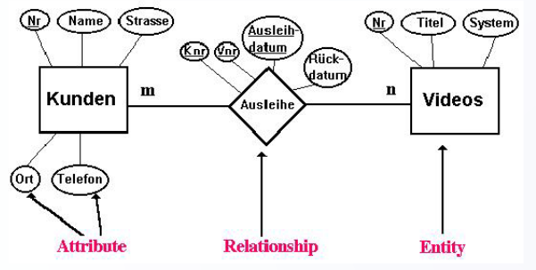

# ERM und ERD
## Unterschied ERM und ERD
Im ERM werden die Beziehungen zueinander nicht detailliert beschrieben, es ist nur eine grobe Zusammenfassung.  
Beim ERD werden dann die Beziehungen mit der Anzahl zu welchen sie sich gegenseitig stehen eingezeichnet.  

Bsp.:  
ERM: Kinder - besuchen - Grundschule  
ERD: Kinder --N(Anzahl)-- besuchen --1(Anzahl)-- Grundschule  
## Konkrete Darstellung
Man Zeichnet die Objekte ein, welche miteinander interagieren. Diese sind hier in den rechteckigen Kästen.  
Wie sie miteinander interagieren wird dann als Rhombus dargestellt.  

## Transformationsregeln
1. Regel
Jeder Entitätstyp wird als Tabelle dargestellt. Jede Tabelle benötigt einen Primärschlüssel.
2. Regel
Jede n:m-Beziehung wird durch eine eigene Tabelle dargestellt.
3. Regel
Jede 1:n- und 1:1-Beziehung mit eigenen Attributen wird wie bei Regel 2 durch eine eigene Tabelle dargestellt.
4. a) Regel 
Jede 1:n-Beziehung ohne eigene Attribute wird so dargestellt, dass der Primärschlüssel des 1-Entitätstyps
Fremdschlüssel des n-Entitätstyps wird.  
    b) Regel
Jede 1:1-Beziehung ohne eigene Attribute wird so dargestellt, dass der Primärschlüssel des ersten Entitätstyps
beim zweiten Entitätstyp Primär- und Fremdschlüssel zugleich wird.  
    c) Regel
Sind Regel 4a oder 4b nicht anwendbar, dann wird für die Beziehung eine gesonderte Tabelle angelegt  