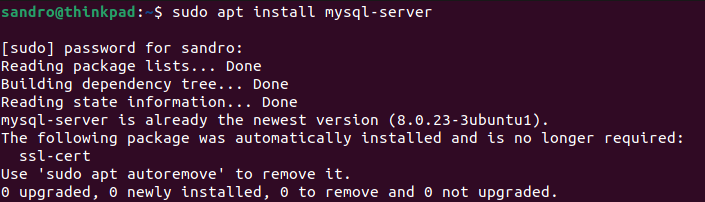
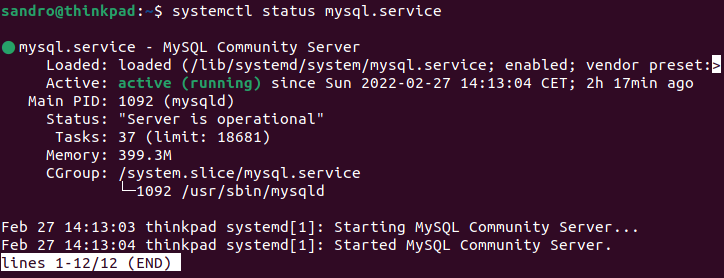

# MySQL

## Installation eines RDBMS | Mysql Auftrag
### Recherche zu MySQL:  
1. Hersteller
    - MySQL wurde von MySQL AB im Jahr 1994 entwickelt.  
    - MySQL AB wurde dann mm Jahr 2008 vom Unternehmen Sun Microsystems übernommen, welches dann in dem Jahr 2010 von Oracle gekauft wurde. 
    - Ab 2010 bis heute gehört MySQL zu Oracle.

2. Lizenzen
    - Es gibt zurzeit 3 verschiedenen Lizenzen. Diese unterscheiden sich im Preis und in den verschiedenen Features.

Version | Preis
-------- | --------
MySQL Standard Edition | USD 2,000
MySQL Enterprise Edition | USD 5,000
MySQL Cluster CGE | USD 10,000

3. Support
    - Ein 24hx7 Support ist bei allen 3 Lizenzen dabei. 
    - Es können Supportfälle angelegt werden.
    - Eine Wissensdatenbank
    - Fehlerbehebungen, Patches und Updates
    - Beratung und Unterstützung  
    Wie hier beschrieben ist: [https://www.mysql.com/de/support/](https://www.mysql.com/de/support/)  

4. Software (Features/Releasezyklen/...)  
Features:  
    - Skalierbar
    - Datentypen
    - Sicher
    - Support  

 Releasezyklen:  
    - Die Releasezyklen dauern sehr lange.  
    Bsp. MySQL 5.6 auf 5.7 hat zwei Jahre gedauert.
    - Zurzeit aktuelle Version: 8.0.28 

 Sonstiges
    - Offiziell herausgekommen am 23. Mai 1995
    - Programmiert in C++ und C

### Voraussetzungen der Installation (VM)
1. Welches Betriebssystem setzen Sie ein? Hardware?  
 Betriebssystem
    - Betriebssystem: Ubuntu 21.04
    - Betriebssystem Typ 64-bit

 Hardware
    - Prozessor: Intel Core i7-8565U CPU @ 1.80GHz × 8 
    - Grafikkarte:  Intel UHD Graphics 620 (WHL GT2)
    - Speicherplatz: 500GB SSD

2. In welcher Version ist Ihr Betriebssystem vorhanden? Kernel?  
- Betriebssystem: Wie oben beschrieben Ubuntu 21.04
- Kernel Version: 5.11.0-16-generic

3. Aus welcher Quelle installieren Sie Ihre Software?  
- Befehl: `apt-cache policy mysql-server`
- http://archive.ubuntu.com/ubuntu hirsute/main amd64 Packages
- http://archive.ubuntu.com/ubuntu hirsute/main i386 Packages

4. In welcher Version installieren Sie Ihre Software (und deren Abhängigkeiten)?  
- Version 8.0.23

4. Welche Dienste laufen sonst noch auf dem Server?  
- Befehl: cat /proc/1/comm 
- systemmd

### Prozess der Installation (Wie/Was habe ich es installiert?)
1. Welche Software (inkl. Abhängigkeiten) wird installiert? Welche Version?
- MySQL Server in der Version 8.0.23.

2. Ablauf der Installation (dokumentiert über Printscreens)
- Ich hatte den Vorteil, das ich MySQL Server bereits installiert habe:  

3. Beschreiben Sie einzelnen Installationsschritte und Entscheidungen die Sie getroffen haben
- `sudo apt update` -> Nach Updates checken.
- `sudo apt install mysql-server` -> Die Installation.
- `sudo mysql_secure_installation` -> Auführung der Sicherheitseinstellungen. Ich habe ein neues Passwort gesetzt. Die Restlichen Konfigurationen habe ich abgelehnt.

### Test der Installation
1. Dokumentieren Sie wie Sie Ihre Installation überprüfen (und was Sie dabei überprüfen)
- `systemctl status mysql.service` -> Testen, ob der Dienst gestartet ist und fehlerfrei läuft.  
  
- `sudo mysqladmin -p -u root version` -> Testen der Datenbankverbindung.  
  

## MySQL installation

## MariaDB (Auftrag: Ein DBMS aus dem Internet raussuchen und die Abkürzungen ACID und BASE einzusetzen)
Auftrag: Suchen Sie sich ein DBMS aus dem Internet raus (nicht MySQL, nicht MongoDB, nicht neo4j) und beschreiben Sie das DBMS. Versuchen Sie dabei so gut als möglich die Abkürzungen ACID und BASE einzusetzen.  

MariaDB ist ein relationales Open-Source-Datenbankmanagementsystem.   
Welches durch eine Abspaltung aus MySQL entstanden ist.  

Eigene Beschreibung zu ACID:  
[MariaDB Blog](https://mariadb.com/resources/blog/acid-compliance-what-it-means-and-why-you-should-care/)  