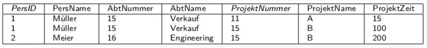
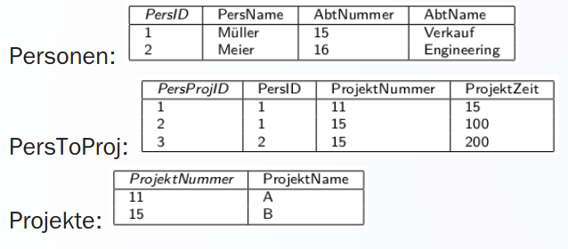
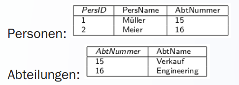

# Normalisierung
## Erste Normalform
In jeder einzelnen Zelle darf nur ein Wert stehen.  

## Zweite Normalform
Aufteulung von allen Nicht-Schlüsselattribut welche nichts vom Gesamtschlüssel abhängig sind.  

## Dritte Normalform
Alle Attribute, die nicht zum Primärschlüssel gehören, müssen direkt von diesem abhängig sein.  
