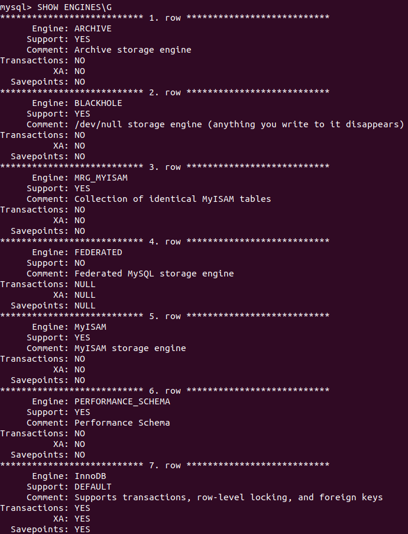
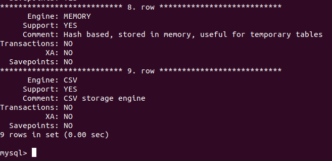
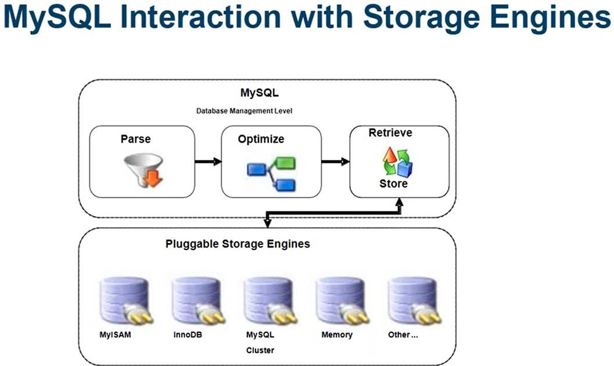

# MySQL Konfiguration
## Auftrag

### Storage Engines bei MySQL
1. Recherche - Dokumentieren Sie ausführlich die 2 wichtigsten (nicht irgendwelche, die wichtigsten) Storage-Engines unter MySQL
-  InnoBD und MyISAM sind die zwei wichtigsten Storage-Engines
2. Recherche - Listen und beschreiben Sie kurz die restlichen Storage-Engines auf Ihrem System
- `SHOW ENGINES\G` kann in MySQL alle Storage Engines auflisten.
- Meine Storage Engines:  
  
  

Restliche Storage Engines:    
- Memory -> Alle Daten werden im RAM gespeichert
- CSV -> Alle Daten werden in einer CSV Daten gepeichert, getrennt mit Kommas.
- Archive -> Für grosse Daten, welche archiviert sind / werden sollen. 
- Blackhole -> Darin können Daten abgelegt werden, sie werden aber nicht gespeichert (Wie das `/dev/null`)
- NDB -> Wird verwendet um die höchste Betriebszeit und Verfügbarkeit zu erreichen. 
- Merge -> Für die Verwendung von Objekten.
- Federated -> Wird verwendet um aus vielen physischen Servern eine logische Datenbank zu erstellen.
- Example -> Beispiel Source Code für eine eigenen Storage Engine. Tabellen können erstellt, aber nicht gespeichert werden.  

Infos von:  
[https://dev.mysql.com/doc/refman/8.0/en/storage-engines.html](https://dev.mysql.com/doc/refman/8.0/en/storage-engines.html)  

3. Überlegen Sie sich welche Daten mit welcher Storage Engine gespeichert werden könnten
- InnoDB -> ACID konform, wird standartmässig verwendet. Für normale Daten.
- MyISAM -> Beötigt wenig Speicherplatz und wird für die Sperrung von Tabellen verwendet. Für Daten, welche nicht bearbeitet werden dürfen.
- Memory -> Temporäre Daten.
- CSV -> Für den import / export von Daten.
- Archive -> Als Archivierung.
- Blackhole -> Als löschung von Daten.
- NDB -> Für Daten, welche immer verfübar seinen müssen. 
- Merge -> Um Daten als Objekte zu speichern.
- Federated -> Für die zusammenführung von Daten.
- Example -> Für die Entwicklung.

4. Dokumentieren Sie wie eine Storage Engine auf eine Tabelle angewendet wird
Wenn Daten geholt oder gespeichert werden müssen, werden die von den Storage Engines geholt / gespeichert.

Ich denke diese Grafik sollte es zeigen:  
  

### Benutzer und Berechtigungen
1. Erstellen Sie eine Demo-Datenbank mit zwei Tabellen
Befele: 
`mysql> create database demo;`  
`mysql> use database demo`  
`mysql> use demo`  
`mysql> create table test (id int);`  
`mysql> create table test2 (id int, name VARCHAR(20));`  

2. Root-Benutzer konfiguriert (Login/Passwort)
Befehle:  
`ALTER USER 'root'@'localhost' IDENTIFIED BY 'xxx';`  
`flush privileges;`  
3. Benutzer konfiguriert (Login/Passwort/Berechtigung auf Datenbank eingeschränkt <- ein Anwendungsbenutzer)
Befehle:  
`CREATE USER 'sandro'@'localhost' IDENTIFIED BY 'xxx';`  
`GRANT select ON demo.test TO 'sandro'@'localhost';`  
4. Admin-Benutzer konfiguriert (Login/Passwort/Berechtigung auf Datenbank eingeschränkt)
Befehle:  
`select * from mysql.user;`  
`CREATE USER 'admin'@'localhost' IDENTIFIED BY 'xxx';`  
`GRANT ALL ON demo.test TO 'admin'@'localhost';`  
5. Verfizieren Sie Ihre Konfiguration und speichern Sie das Resultat in Ihrer Dokumentation
Oben gemacht.  
### Server-Konfiguration
1. Transaktions-Isolation : Verfizieren Sie welche Transaktions-Isolation auf Ihrem Server aktiviert ist. Dokumentieren Sie, was das bezüglich den Anomalien für Ihre Installation bedeutet.
Befehl:  
`SELECT @@global.transaction_ISOLATION;`  
Resultat: REPEATABLE-READ -> Dirty Read sind unmöglich, Lost Updates sind unmöglich, Nonrepeatable Read sind unmöglich und Phatom Read sind möglich.
2. Exportieren Sie die aktuelle Liste an System-Variablen
3. Netzwerkkonfiguration DBMS-Server anpassen und dokumentieren

### Server-Betrieb
1. Protokollierung langsamer Abfragen aktivieren
2. Listen Sie den Inhalt des Data-Directories auf
3. Dokumentieren Sie die Default-Datenbanken mysql, sys, performance_schema
