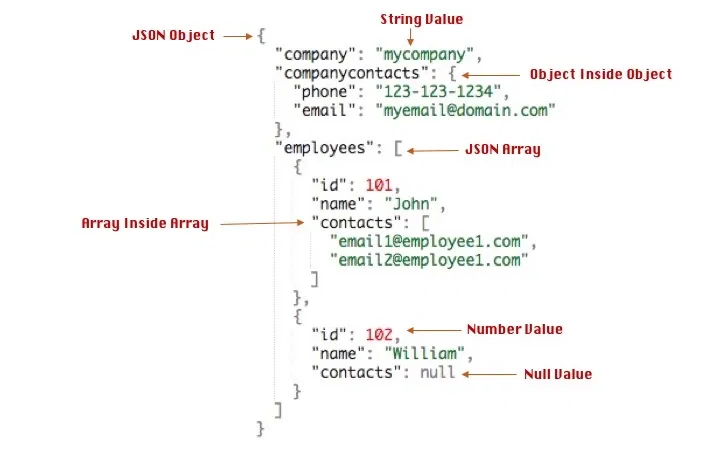

# Datentypen

    Recherchieren Sie zu Datentypen in MySQL
    Spezialtyp : JSON als Datentyp beschrieben und ein Beispiel dokumentiert
    Spezialtyp : ENUM als Datentyp beschrieben und ein Beispiel dokumentiert
 
MySQL unterstützt alle Standard Datentypen welche für die Speicherung von Zahlen und Fliesskommazahlen dient (TINYINT / SMALLINT / MEDIUMINT / INT / BIGINT / FLOAT / DOUBLE, REAL / DECIMAL / BIT / BOOLEAN / SERIAL).  

Dazu kommen die Datums und Uhrzeit Formate (DATETIME / DATE / TIMESTAMP / TIME / YEAR).  

Buchstaben, Zahlen, Sonderzeichen und Wörter können in String Typen gespeichert werden (CHAR / VARCHAR / TINYTEXT / MEDIUMTEXT / LONGTEXT / TEXT / BINARY / VARBINARY / TINYBLOB / BLOB / MEDIUMBLOB / LONGBLOB / ENUM / SET).  

Es gibt Werte, welche in räumlichkeiten verwendet werden können (GEOMETRY / POINT / LINESTRING / POLYGON / MULTIPOINT / MULTILINESTRING / MULTIPOLYGON / GEOMETRYCOLLECTION).   

Zum Schluss gibt es auch noch Spezielle Datentypen (bsp. JSON).  

# JSON
Mit dem JSON Datentyp kann man JSON Texte in einer Spalte speichern.  

JSON besteht aus Objekten und Arrays.  
Objekte werden mit **{ }** gebildet und Arrays mit **[ ]**.  

JSON sieht folgendermassen aus:  
  

Tabelle mit einem JSON Datentyp erstellen:  
```sql
CREATE TABLE tabelle (
    json_spalte JSON
);
```

Datensatz mit einem JSON Text in die Tabelle einfügen:  
```sql
INSERT INTO tabelle(json_spalte) 
VALUES('{"Name":"Sandro","Nachname":["Schmitt","Cangelosi","Jürg"]}');
```
# ENUM
Mit dem ENUM Datentyp können Auswahllisten erstellt werden.  
Bei einem Insert muss dann einer dieser Werte ausgewählt werden, sonst wird der Wert als **''** gespeichert.  
Der Wert aus der Liste muss entweder mit dem Namen exakt übereinstimmen oder kann mit einer Zahl ausgewählt werden.  
**Die erste Auswahl aus der Liste ist die 1, nicht die 0.**  
Die 0 steht für nicht gültig.  

Tabelle mit einem ENUM Datentyp erstellen:  
```sql
CREATE TABLE tabelle (
    qualitaet ENUM('Sehr gut','Gut','Mittel','Schlecht')
);
```

Datensatz mit einem Wort aus der Liste in die Tabelle einfügen:  
```sql
INSERT INTO tabelle(qualitaet) 
VALUES('Sehr Gut');

INSERT INTO tabelle(qualitaet) 
VALUES(1); -- 1. Wert = Sehr Gut
```