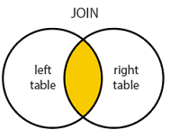

# Joins
Wenn man mit einem **select** Daten aus zwei oder mehr Tabellen anziegen möchte, verwendet man joins.  
So können Daten aus den beiden (oder mehr) Tabellen welche die gleichen Werte haben ausgegeben werden.  
  
Zusammenfassung:  
  

## Inner Join
Bei einem (inner) join, werden nur Daten angezeigt, welche in beiden Tabellen vorhanden sind. So entstehen keine NULL Werte.  
Diese werden dann nicht angezeigt.  

Beispiel:  
  

So werden in diesem praktischem Beispiel nur Datensätze angezeigt, welche belgt sind und zueinander gehören.  
  
*Bei "Schueler s" und "belegt b" wird die Tabelle als Buchstabe abgekürzt*  

## Outter / Full Join
Nimmt die Werte von beiden Tabellen und fügt sie zusammen.  
Falls es keine Übereinstimmungen mit der **ON XXX** Bedinung gibt, werden die Fehlenden Felder mit NULL gefüllt.  
Dies gilt für beide Tabellen.  

 

## Left Join
Holt alle Werte von der ersten Tabelle, welche mittels **xxx FROM tabelle** definiert wurde und füllt die Werte von der **xxx JOIN tabelle** Tabelle auf.  
Falls es keine Übereinstimmungen mit der **ON XXX** Bedinung gibt, werden die Werte von der 2. Tabelle mit NULL gefüllt (**xxx JOIN tabelle**).  

 

## Right Join
Holt alle Werte von der zweiten Tabelle, welche mittels **xxx JOIN tabelle** definiert wurde und füllt die Werte von der **xxx FROM tabelle** Tabelle auf.  
Falls es keine Übereinstimmungen mit der **ON XXX** Bedinung gibt, werden die Werte von der 1. Tabelle mit NULL gefüllt (**xxx FROM tabelle**).  

 