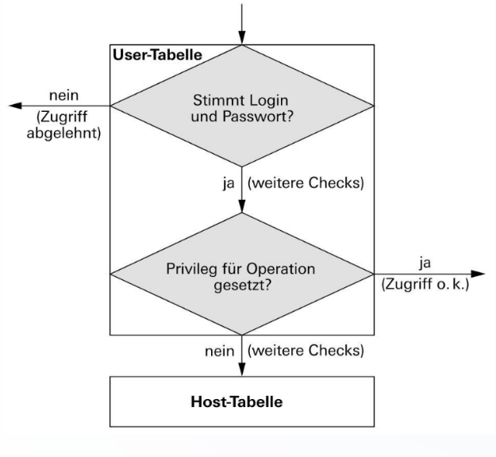
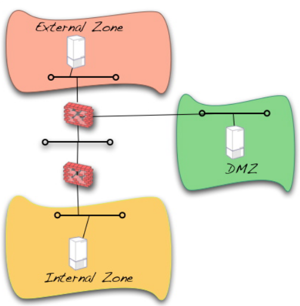

# Sicherheit und Berechtigungen
## Generell - Berechtigungen  
Wichtige Befehle:  

Berechtigung für die Datenbank und alle Tabellen darunter geben:  
```sql
GRANT ALL PRIVILEGES ON databasename.* TO 'newuser'@'localhost';
```
*Der Stern steht für die Tabellen*  

Berechtigungen aktualisieren:  
```sql
FLUSH PRIVILEGES;
```

## Ablauf der Zugriffregelung  
Ablauf:    
  

## Sichheit
### DMZ
Die Applikation solle praktischerweise in der DMZ plaziert werden.  
So kann man unterscheiden zwischen internen und externen Zugriffen.  

Beispiel, hier fehlt noch die zweite Linie damit zwischen extern und inter unterschieden werden kann:      
  

### SSH und SSL
Dazu sollte man seine Applikation verschlüsseln, dazu gehört SSH und SSL.  

### SQL-Injections
Mit einer Input Validierung können SQL-Injections verhindert werden.

### Richtige Berechtigungen setzen
Auf Files von der Applikation die nötigen Berechtigungen setzen (r/w/e).  