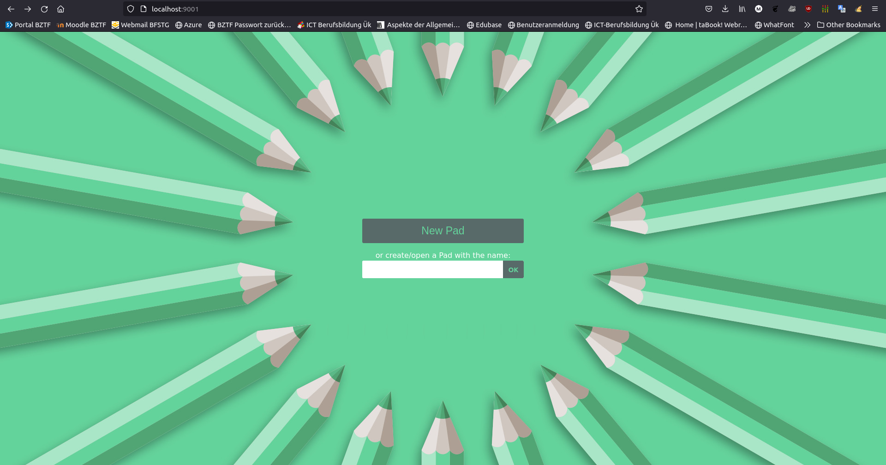

# Etherpad
## Installation
Im ersten Schritt beide Befehle für die Installationsumgebung ausführen:  
```bash
curl -sL https://deb.nodesource.com/setup_14.x | sudo -E bash -
sudo apt install -y nodejs
```

Ins gewünschte Verzeichnis wechseln, wo die Installation beginnen soll und dann diesen Befehl ausführen:   
```
git clone --branch master https://github.com/ether/etherpad-lite.git
cd etherpad-lite
```

## MySQL Vorbereitungen
Zu erst wird eine DB Erstellt, dann wird ein Benutzer mit Passwort erstellt welcher im letzten Schritt noch Berechtigungen bekommt.  
Benutzername und Passwort bei Ausführen noch ändern, sowie evtl. der DB Name.  
```sql
create database `etherpad_lite_db`;

CREATE USER 'etherpaduser'@'localhost' identified by 'password';
ALTER USER 'etherpaduser'@'localhost' IDENTIFIED WITH mysql_native_password BY 'password';

grant CREATE,ALTER,SELECT,INSERT,UPDATE,DELETE on `etherpad_lite_db`.* to 'etherpaduser'@'localhost';
```

## Settings / Einstellungen ändern

Erstens, das Setting File kopieren und bearbeiten:  
```bash
cp settings.json.template settings.json

nano settings.json
```

In der Zeile 211 im File, die Eisntellungen anpassen:  
```json
"dbType" : "mysql",
"dbSettings" : {
    "user"    : "etherpaduser",
    "port"    : "/var/run/mysqld/mysqld.sock",
    "password": "secret",
    "database": "etherpad_lite_db",
    "charset" : "utf8mb4"
}
```

## Plugins installieren
Zusätzlich könnte man noch Plugins installieren:  
```bash
npm install --no-save --legacy-peer-deps ep_headings2 ep_markdown ep_comments_page ep_align ep_font_color ep_webrtc ep_embedded_hyperlinks2
```

## Starten der Applikation
Mit diesem Befehl startet man Etherpad:  
```bash
src/bin/run.sh
```

Dann kann man mittel [http://localhost:9001](http://localhost:9001) Etherpad öffnen, dann sieht es bei der erfolreichen Installation folgendermassen aus:  
  

## Aufgabe: Diskutieren Sie die Security-Angriffsvektoren anhand der Applikation Etherpad
- Applikation in der DMZ einsetzen.  
- Berechtigung auf die Einstellungen geben.  