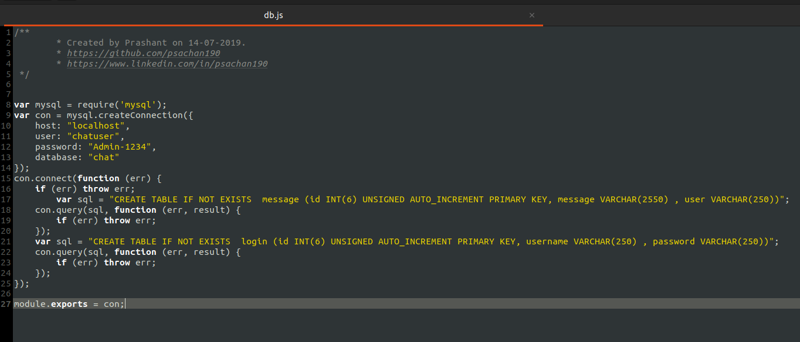
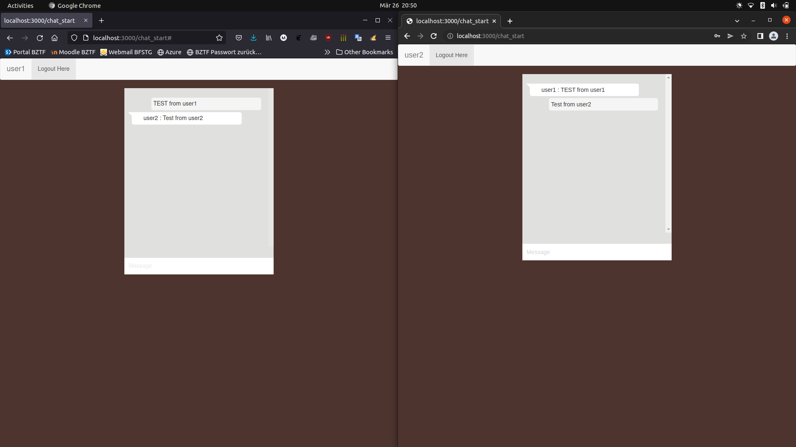
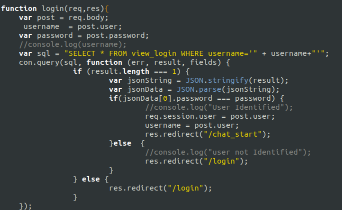
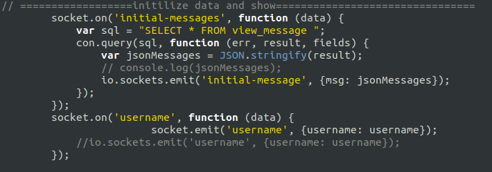
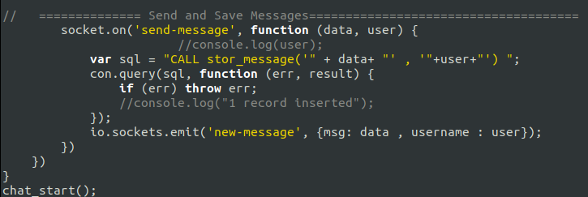
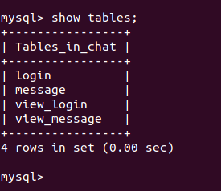
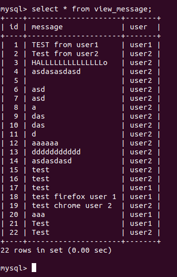
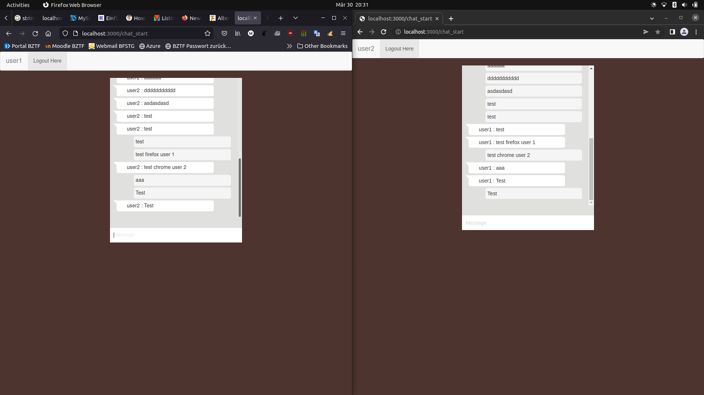

# Chat-Applikation
## Installation und inbetriebname
1. Im ersten Schritt mussten wir das Github Repository klonen (Link: [Link](https://github.com/psachan190/realtime-chat-application-using-nodejs-expressjs-and-web-socket)).  

2. In den Ordner `realtime-chat-application-using-nodejs-expressjs-and-web-socket` wechseln und `npm install` im Terminal ausführen.  

3. Datenbank für die Applikation erstellen:
```sql
CREATE DATABASE chat;
```

4. Die Datei `database/db.js` so anpassen (Benutzer, Passwort und DB):  
  

5. Die Chat Applikation im Terminal starten mit dem Befehl: `node server.js`  

6. In die DB anmelden und folgende Befehle ausführen (Für die Erstellung der beiden Benutzer):  
```sql
INSERT INTO login VALUES ('1','user1','user1');
INSERT INTO login VALUES ('2','user2','user2');
```

## Testing  
1. In zwei Brosern folgenden Link öffnen ([http://localhost:3000](http://localhost:3000)) und sich mit `user1` und `user2` anmelden.  

2. Jetzt kann man bereits die Applikation testen:  
  

# Auftrag Anwendung:
1. Führen Sie für die Applikation eine Stored-Procedures und eine View ein.  
2. Passen Sie die Applikation entsprechend an und testen Sie sie aus  

Die Datei `server.js` habe ich folgendermassen angepasst:  
1. Ich habe eine View für die beiden Login Accounts erstellt und hier eingebunden:   
  
  
2. Ich habe eine View für die Nachrichten erstellt und hier eingebunden:  
 
  
3. Zum Schluss habe ich eine Storage Procedure für die Erstellung von Nachrichten erstellt:  

  

Das sind schlussendlich alle Tabellen:  

  
So werden die Nachrichten gespeichert:  

  
Wenn man nun von beiden Accounts einander geschrieben hat, hat es so ausgesehen:  
