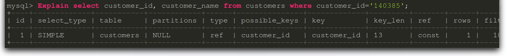
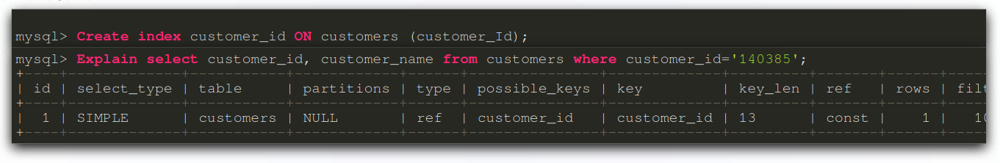

# Performance - Indexing
Damit Abfragen bei grösseren Datenbanken kein Performance Problem verursachen, wird Indexing eingesetzt.  
Der Index zeigt entweder auf einen anderen Index oder auf einen Datensatz.  
Dieser hat den Vorteil, das Abfragen deutlich schneller gemacht werden können.  
Es wird aber zusätzlicher Speicher dafür verwendet.  

## Allgemeine Tipps
1. Attribute indexieren (Bei WHERE, ORDER BY, GROUP BY)
2. UNIONS verweden (UNIONS statt or verwenden)
3. Wildcards (Bei SELECTS Wildcards vermeiden)
4. Full TExt Searches nutzen (Besser als Wildcards)

## Datenbank Design 
1. Tabellen normalisieren / keine Redundaten Daten
2. Passende Datentypen verwenden
3. NULL Werte vermeiden
4. Weniger Spalten / Attribute im Design verwenden
5. Bei SQL Joins nur Tabellen anzeigen lassen, welche auch nötig sind (Keine "SELECT *")
6. MySQL Query Caching aktivieren (Caching von Abfragen)

## Werkzeug / Befehl EXPLAIN
Mit dem Befehl EXPLAIN sieht man verschiedene Informationen zu dem Befehl.  
So wird auch aufgelistet, wie perfomat die Abfrage ist (type).  
Wenn die Zeile "type" "NULL" ist ist das schlecht, "ref" ist hingegen schon besser.  

Schlechte Abfrage:  

  
Gute Abfrage :  


## Index erstellen  
Ein Index kann mit diesem Text erstellt werden:  
```sql
CREATE index spalte_id ON Tabelle (spalte_id)
```